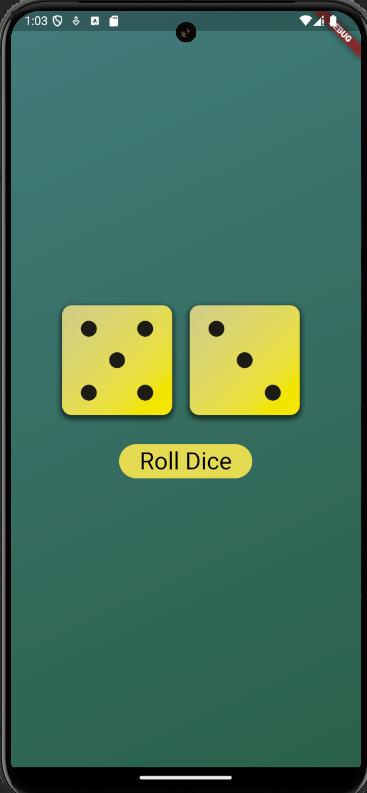

# Dice Roller Application (Zar Atma Uygulaması)

**Turkish (Türkçe)**

## Proje Açıklaması

Bu Flutter uygulaması, kullanıcıların zar atmasına olanak tanıyan basit bir zar atma uygulamasıdır. Kullanıcı, zarın kaç geldiğini görmek için bir butona tıklayabilir.

## Özellikler

- Rastgele zar atma
- Zarın sonucunu gösterme
- Kullanıcı dostu arayüz

## Ekran Görüntüleri

Aşağıda uygulamadan bazı ekran görüntülerini bulabilirsiniz:


*Ana Ekran Görseli*

## Kurulum

1. Kodu bilgisayarınıza indirin:

    ```bash
    git clone https://github.com/YenerCenger/Dice-Roller-Application.git
    cd Dice-Roller-Application
    ```

2. Gerekli bağımlılıkları yükleyin:

    ```bash
    flutter pub get
    ```

3. Uygulamayı çalıştırın:

    ```bash
    flutter run
    ```

## Dikkat Edilmesi Gerekenler

- Uygulama, kullanıcıların zar atmalarına olanak tanır ve sonuçları anında gösterir.
- Kullanıcı dostu bir arayüze sahiptir.

## Katkıda Bulunma

Eğer bu projeye katkıda bulunmak istiyorsanız, lütfen bir çekme isteği (pull request) açın. Büyük değişiklikler yapmadan önce, lütfen tartışma bölümünde konuyu açın.

## Lisans

Bu proje [MIT Lisansı](LICENSE) altında lisanslanmıştır. Daha fazla bilgi için [LİSANS DOSYASI](LICENSE) dosyasını inceleyin.

---

**English**

## Project Description

This Flutter application is a simple dice roller that allows users to roll a die. Users can click a button to see the result of the roll.

## Features

- Random dice rolling
- Displaying the result of the die
- User-friendly interface

## Screenshots

Below are some screenshots from the app:


*Main Screen Image*

## Installation

1. Clone the code to your computer:

    ```bash
    git clone https://github.com/YenerCenger/Dice-Roller-Application.git
    cd Dice-Roller-Application
    ```

2. Install the required dependencies:

    ```bash
    flutter pub get
    ```

3. Run the app:

    ```bash
    flutter run
    ```

## Notes

- The app allows users to roll a die and shows the results instantly.
- It has a user-friendly interface.

## Contributing

If you want to contribute to this project, please open a pull request. Before making significant changes, please open a discussion in the Issues section.

## License

This project is licensed under the [MIT License](LICENSE). For more information, see the [LICENSE](LICENSE) file.
